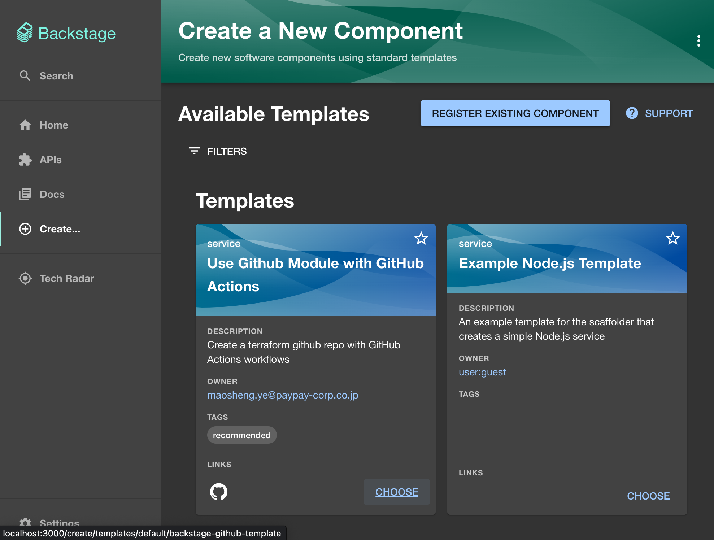
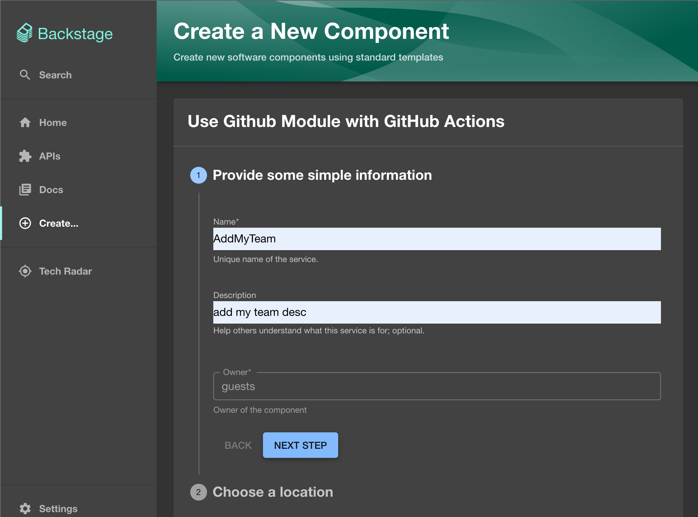
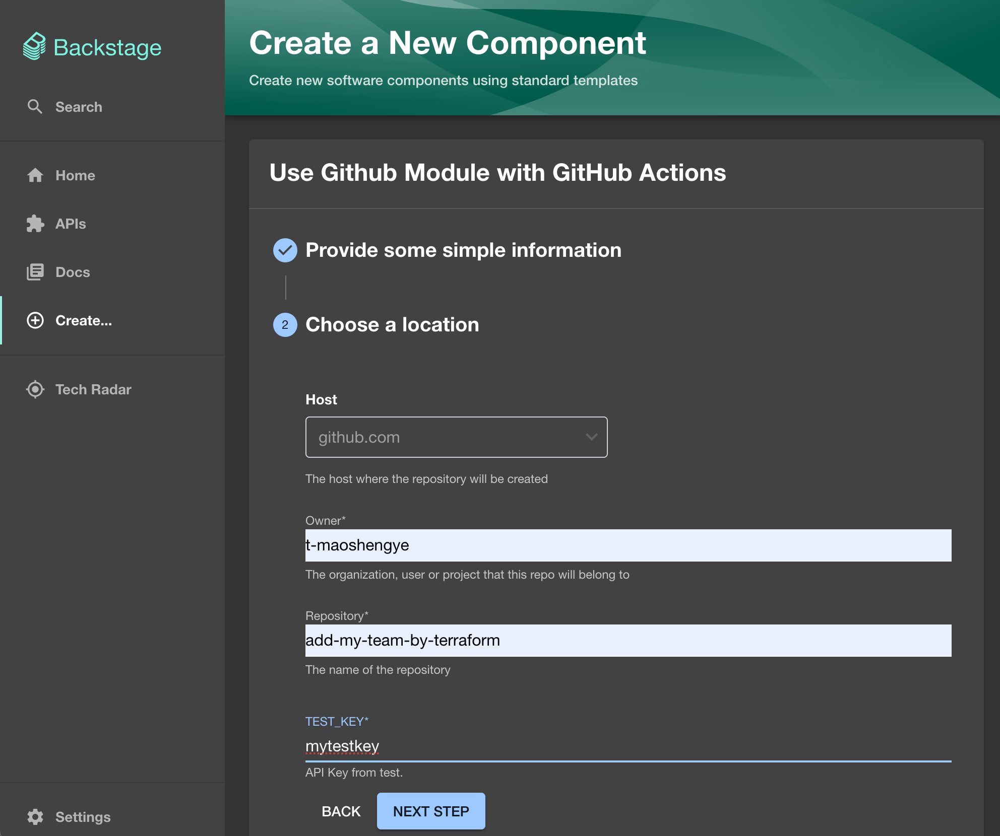
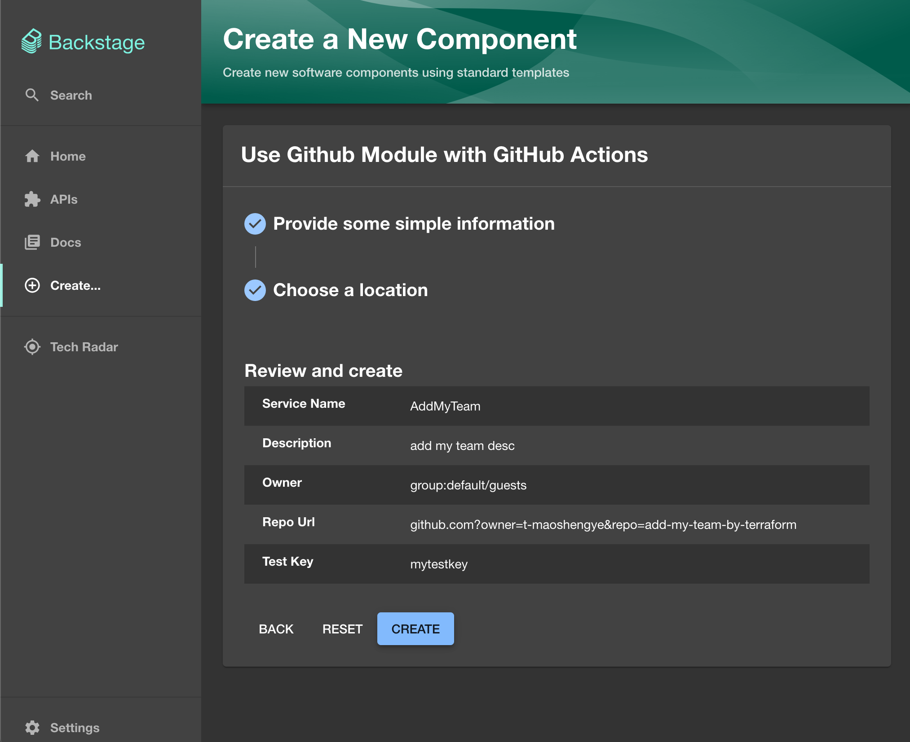
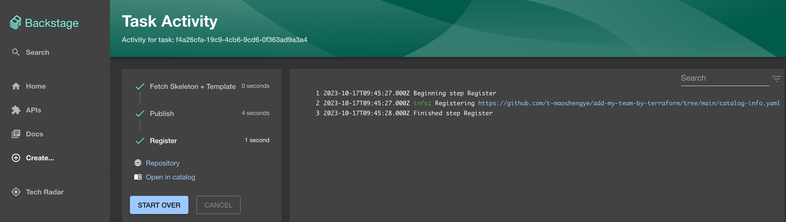
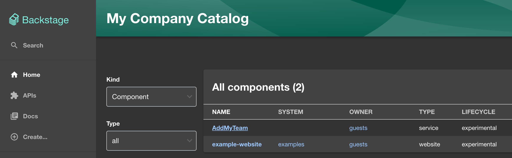
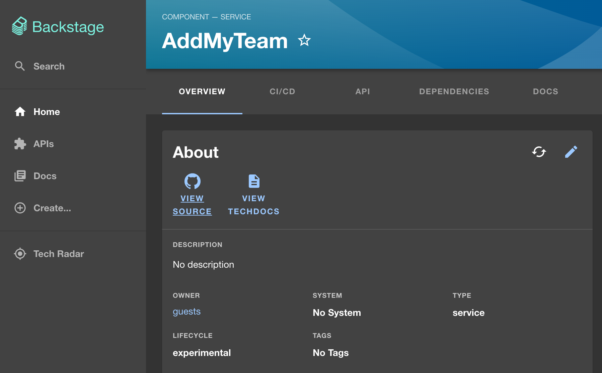
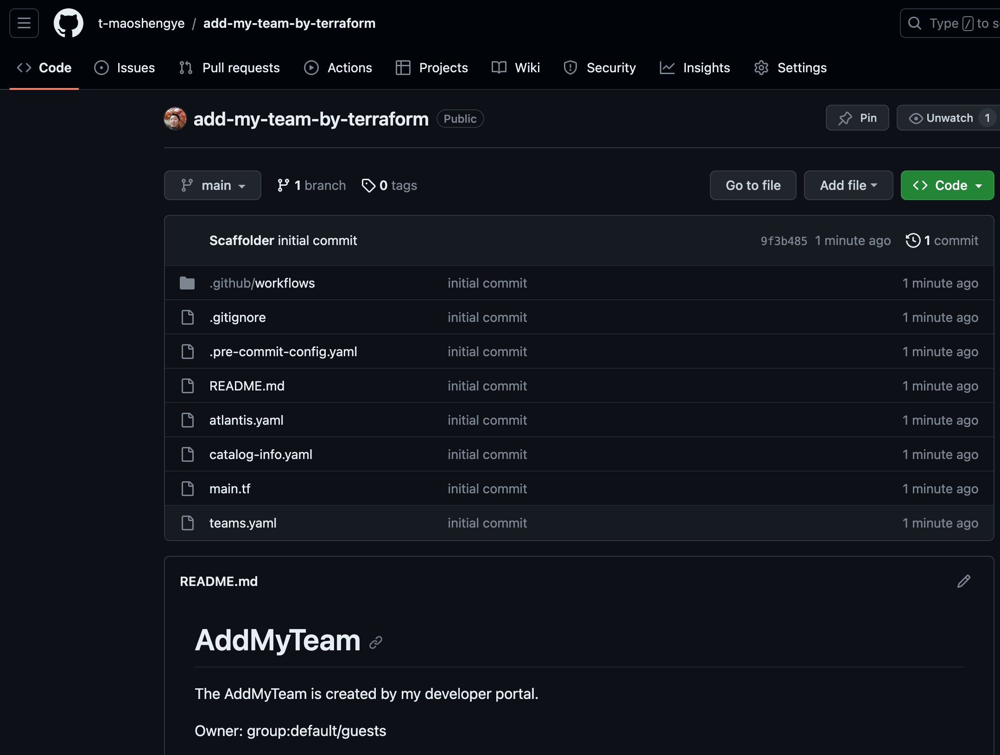
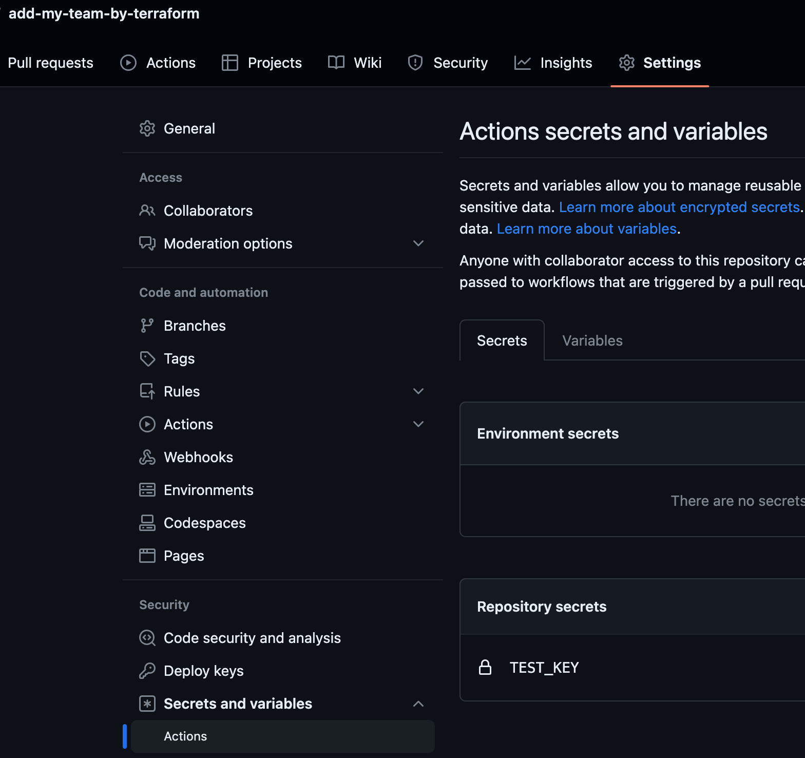

# backstage-github-template

### Updating Backstage's `catalog-info.yaml`

To add this template to your Backstage, update your `catalog-info.yaml` with the following code:

```yaml
- type: url
  target: https://github.com/t-maoshengye/backstage-github-template/blob/main/template.yaml
  rules:
    - allow: [Template]
```

### Usage Steps

##### Step 1



##### Step 2



##### Step 3



##### Step 4



##### Step 5



##### Step 6



##### Step 7



##### Created Repo



##### TEST_KEY


